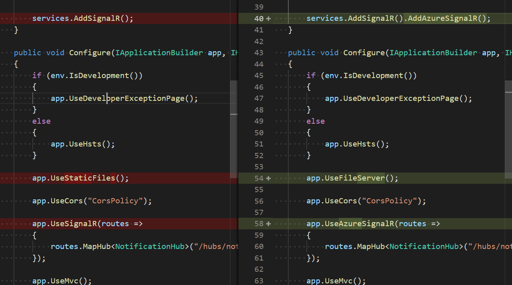
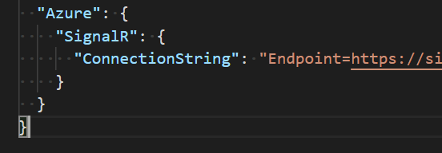

## How it works

**NotificationProducer** generates a "notification" every second, and then:
- writes the notification into a Redis list
- publishes an event on Redis channel to notify all listeners there is a new entry in the list.

Additional step with the list is there because pub-sub does not guarantee that only one consumer will process the notification, while "locking" on a list makes it a sure thing (pop operation is atomic).

**Redis** is well, a nice message broker in this case. Redis is a nice fit for scenarios where "notification" scenario is required, which means that websockets and such are just an improvement over the existing data fetching strategy (e.g. rest call on start of the app). Redis as showcased here should not be used for durable messaging of business critical data!

**BackendForFrontend** (multiple instances of it) subscribes to redis channel, processes the new list entry (only once), and notifies all connected frontends over SignalR.

**Frontend** is a simple Angular app showing toasts when notifications arrive.

*optional* **Azure SignalR Service** can be used to offload websocket connections between BFF and Frontend. For instructions, check below.

## Getting started

### Locally with docker & compose

Simply run docker-compose up from the source code root.

### With a Kubernetes cluster

**prerequisite:** 
k8s cluster with 
- an access to a registry
- ingress controller (or ignore the ingress and modify the services to expose them directly over LB or node port). Beware: Ingress is written with path based routing only, meaning the complete host is presumed to be free (/ is the app, /app & /hubs is pointed to bff).

Run `BuildAndPush-Containers.ps1` and `Deploy-Application.ps1` (you need the URL of your registry as a mandatory parameter for the scripts, so call the scripts like `BuildAndPush-Containers.ps1 -DockerRegistryUrl your_url_here`)
To re-deploy, delete the k8s realtime-microservices namespace

## Side notes

### Websockets

For websockets to work through ingress, sticky session has to be used, which is implemented using affinity cookies at the moment (check the ingress definition of the BFF) 

### Auth

Is not implemented but if required it would be done in the same way as the normal auth is done in asp.net core (e.g. token based, [Authorize] atrribute over the signalr hub etc.)

### Using Azure SignalR Service

Azure SignalR service can offload websocket connections away from your server. Setup is easy:

- Do the following changes in the code:

- Add the connection string value in config file (for backend for frontend):

### Redis
Check redis: `kubectl run redis-cli-image -i --tty --rm --image redis -n realtime-microservices -- /bin/sh`
You can then run something like `redis-cli -h redis` and `SUBSCRIBE Notification-Channel`